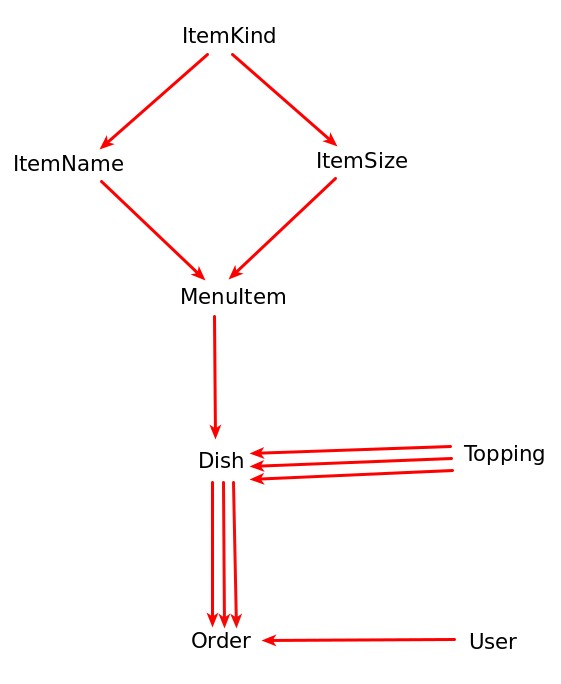

# Pizza order website (Work in progress)

This is (potentially) a solution for the third problem from CS50 course conducted at Harvard University. The course is accessible through edX platform: https://www.edx.org/

## Description

The goal is to develop own version of following website: http://www.pinocchiospizza.net/menu.html with additional ability allowing users to place orders composed of dishes listed in menu.

## Running

The program requires Django installed to run. Type `python3 manage.py runserver` and copy output link from terminal to go to the basic route.

The file `extract data.ipynb` extracts data from orignal website to .csv files `menu_tables.csv` and `menu_toppings.csv`. Running `import csv.py` file with command `python3 manage.py import\ csv.py` inserts `.csv` files' inner into the database.

The database file `db.sqlite3` has already inserted menu data from the orignal site and also contains already created superuser (username: `admin`, password: `abc123`).

## Database

The database diagram is shown below. All menu data is stored in 4 tables, connected with foreignkeys. The arrowhead points to a table which posses foreignkey of a table at the arrow start. 3 parallel arrows mean 'many to many relation'.

- `ItemKind` table consists of all possible dish **kinds**.

- `ItemName` table consists of all possible dish **names** with the same **kind**, and defines number of toppings in case of pizzas.

- `ItemSize` table consists of all possible **size variants** for specified dish **kind**.

- `MenuItem` table defines **price** of a dish for corresponding **kind, name and size**.

- `Topping` table defines names of available toppings for pizza

- `Dish` table concats **kind, name, size, price** info with selected toppings for pizza, which are a list of `Topping` objects.

- `Order` represents single `User`'s order, which consists of list of `Dish` elements.

- `User` is a standard django table with normal and superusers info, used for logging and authentificating users.

### Progress so far

02.02.2020:
- database structure in file `orders/models.py` is complete
- program for data extracting from original website and inserting it into database is complete
- creating dishes and orders works properly and is possible so far only from admin site (route `/admin`):
1) First you have to create a new empty `order` (at least one)
2) Then you can create various `dishes` and assign them to a choosed `order`. The order consists of dishes which the user is going to see in their cart.
3) Note: a `dish` differs from a `menu item` is such way, that in case of creating a pizza kind `dish` you can assign **various** `toppings` to it, where `menu item` pizza only defines **number** of `toppings`.

03.02.2020
- you can view price menu with links to corresponding pizza's info

07.02.2020
- exchanged the notebook that <ins>extracts data from web and inserts into database</ins> to a notebook <ins>that extracts data to .csv file</ins>
- extracted data can be inserted into the database using django's ORM outside of the app by running the file `import csv.py`

08.02.2020
- added forms to properly (as tested so far) customize pizzas (add/delete toppings, change size, alter price) by users

9.02.2020
- added form to properly add/delete dishes to card and display overall price

13.02.2020
- login/register for users is available

### To do

- <strike>login/logout for users</strike>**done**
- <strike>`/` route with menu items listed</strike>**done**, all with `add to cart` buttons
- <strike>`/<item_id>` route allowing users to customise dishes</strike>**done for pizzas** <strike>and add them to cart</strike>**done**
- `/cart` <strike>route with all dishes created by logged user, with total amount of $ to bill</strike>**mostly done** and with a textfield allowing the user to leave an additional message for restauration's owner
- **start making unit tests!**
